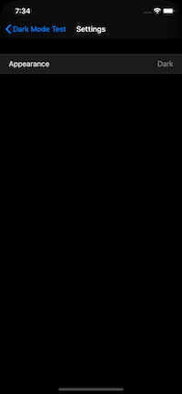
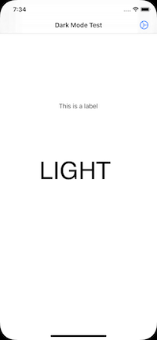
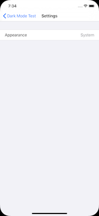

# DarkModeDemo

A project demoing the user of dark mode in an app.  I wanted to allow a user to override the system setting with dark or light.  Maybe the users wants the system to be light but this particular app to be dark.

